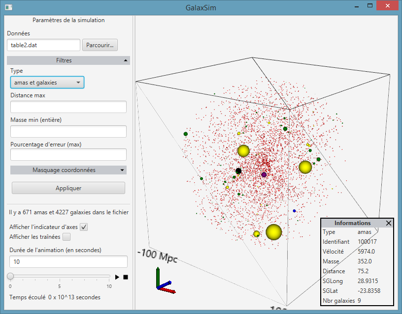

# GalaxSim

GalaxSim est un logiciel qui permet de visualiser le mouvement des galaxies
qui nous entourent en simulant leurs déplacements. 
La visualisation est centrée sur notre galaxie

## Contrôle de la caméra

La caméra de la simulation peut être déplacée afin de visualiser les éléments 
sous un autre angle de vue :

* Molette : contrôle du zoom
* Maintient du clique droit : déplacement latéral
* Maintient du clique molette : rotation de la caméra

## Filtrage des éléments

Le nombre d'amas et de galaxies peut être diminué à l'aide des filtres suivants. 
Il n'est pas nécessaire de les remplir : en cas de valeur vide, une valeur par défaut
pourra être appliquée dans certains cas (voir la description de chaque filtre). 

**Distance maximale** : par défaut, seuls les éléments situés à une distance inférieure à 100 MPC. Cette distance
peut être diminuée (mais pas augmentée) grâce au filtre de distance : celui-ci accepte
un nombre entier compris entre 1 et 100 inclus.

**Masse minimale** : chaque élément possède une masse, il est possible de les filtrer
en définissant une masse minimale. 
Ce filtre requiert un nombre entier supérieur à 0.

**Masquage de coordonnées** : en cliquant sur le menu déroulant, vous aurez accès à 9 champs
représentant les coordonnées minimales et maximales sur les axes X, Y et Z. Ce filtre permet
par exemple d'isoler les éléments sur un plan pour comparer les résultats avec des
graphiques en 2d. 
Aucun champ n'est obligatoire mais la valeur doit être un nombre entier compris entre
-100 et 100 inclus.

## Ressources

* Icones venant du pack [Material Design](https://material.io/tools/icons/?style=baseline) de Google